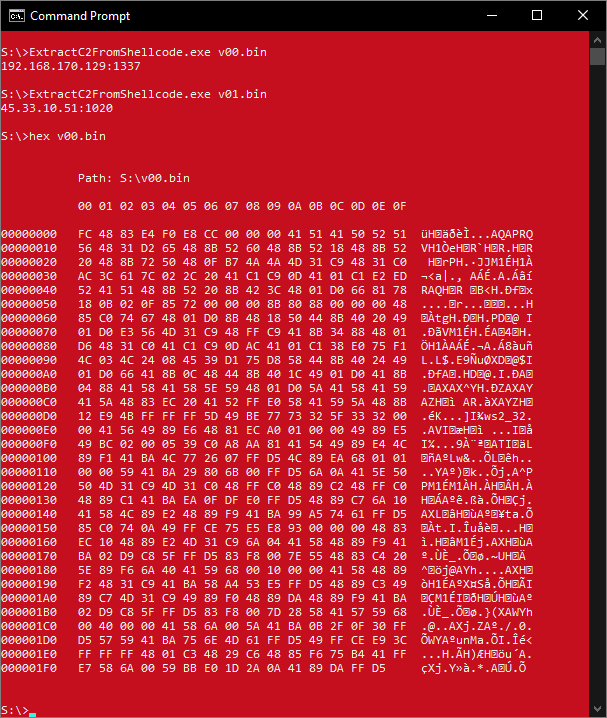

# ExtractC2FromShellcode
Tool to extract C2 ip adresses from shellcode

Extracts C2 (ip adress and port) from a bit of shellcode (file on disk). Uses binary format, not a hexdump.
See example in the image above.
